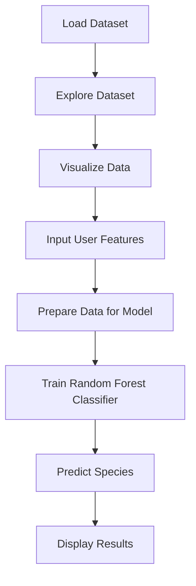

# 🐧 Penguin-Species-Classifier[Machine Learning App]

This is an interactive web application built using Streamlit that predicts the species of penguins based on user-provided features. The app uses a **Random Forest Classifier** machine learning model for prediction and provides insights into the dataset with visualizations.

---

## 📊 Features

1. **Penguin Species Prediction**:
   - Predicts the species of penguins (“Adelie”, “Chinstrap”, or “Gentoo”).
   - Uses features like bill length, bill depth, flipper length, body mass, island, and gender.

2. **Data Visualization**:
   - Provides a scatter plot to visualize the relationship between penguin features such as bill length and body mass.

3. **Interactive Input**:
   - Allows users to input penguin features through sliders and dropdowns for real-time predictions.

4. **Probability Display**:
   - Shows the probability of each penguin species based on the input features.

---

## 🔎 Dataset

The app uses the **Palmer Archipelago (Antarctica) penguin dataset**:

- **Source**: [Palmer Penguins Dataset](https://github.com/dataprofessor/data/blob/master/penguins_cleaned.csv)
- **Features**:
  - `island`: Island where the penguin was found.
  - `bill_length_mm`: Length of the penguin’s bill (in mm).
  - `bill_depth_mm`: Depth of the penguin’s bill (in mm).
  - `flipper_length_mm`: Length of the penguin’s flipper (in mm).
  - `body_mass_g`: Weight of the penguin (in grams).
  - `sex`: Gender of the penguin.
- **Target**: `species` (Adelie, Chinstrap, Gentoo).

---

## ⚖️ Machine Learning Model

The app uses the **Random Forest Classifier**:

- A robust, ensemble-based machine learning algorithm.
- Combines predictions from multiple decision trees for high accuracy.
- Encodes categorical variables like `island` and `sex` using one-hot encoding.
- Maps target labels (“Adelie”, “Chinstrap”, “Gentoo”) to numerical values for training.

---

## 🔧 Installation

Follow these steps to run the app locally:

### Prerequisites
- Python 3.8 or higher
- Install required Python libraries:
  ```bash
  pip install streamlit pandas numpy scikit-learn
  ```

### Clone the Repository
```bash
git clone <repository-url>
cd <repository-folder>
```

### Run the App
```bash
streamlit run app.py
```

---

## 📊 How It Works

1. **Load the Data**: Loads the penguin dataset from a public URL.
2. **Explore the Data**: Displays raw data and visualizations.
3. **Get User Inputs**: Accepts user inputs via sliders and dropdown menus for features like bill length, bill depth, flipper length, etc.
4. **Prepare Data**: Encodes categorical data and scales numerical features as needed.
5. **Train the Model**: Trains a Random Forest Classifier on the dataset.
6. **Make Predictions**:
   - Predicts the penguin species based on user inputs.
   - Displays probabilities for each species.

---

## 🔄 Workflow Diagram



---

## 🎮 App Interface

1. **Sidebar**:
   - Input penguin features (island, bill length, bill depth, etc.)
   - Real-time predictions based on the inputs.

2. **Main Page**:
   - Raw data table.
   - Scatter plot visualization of bill length vs. body mass.
   - Probabilities of each species and the predicted species.

---

## 🚀 Example Usage

1. Open the app by running the command `streamlit run app.py`.
2. Input the following example values:
   - Island: Dream
   - Bill length: 45 mm
   - Bill depth: 18 mm
   - Flipper length: 200 mm
   - Body mass: 4000 g
   - Gender: Male
3. The app predicts the penguin species (e.g., **Gentoo**) and displays probabilities for all species.

---

## 🔧 Technologies Used

- **Frontend**: Streamlit for interactive UI.
- **Backend**: Python for processing data and machine learning.
- **Machine Learning**: Scikit-learn’s Random Forest Classifier.
- **Data Visualization**: Streamlit’s charting tools.

---

## ⚙️ Future Improvements

- Add additional visualizations (e.g., histograms for each feature).
- Allow users to upload their datasets for predictions.
- Include more advanced machine learning algorithms for better accuracy.

---

## 🛠️ Troubleshooting

1. **Missing Libraries**:
   - Ensure all required libraries are installed.
   - Run: `pip install -r requirements.txt`.

2. **Dataset Issues**:
   - Ensure you have internet access as the dataset is fetched from a URL.

---

## 📢 Credits

- Dataset Source: [Palmer Penguins Dataset](https://github.com/dataprofessor/data/blob/master/penguins_cleaned.csv)
- Developed by: [Manjeet Singh]

---


